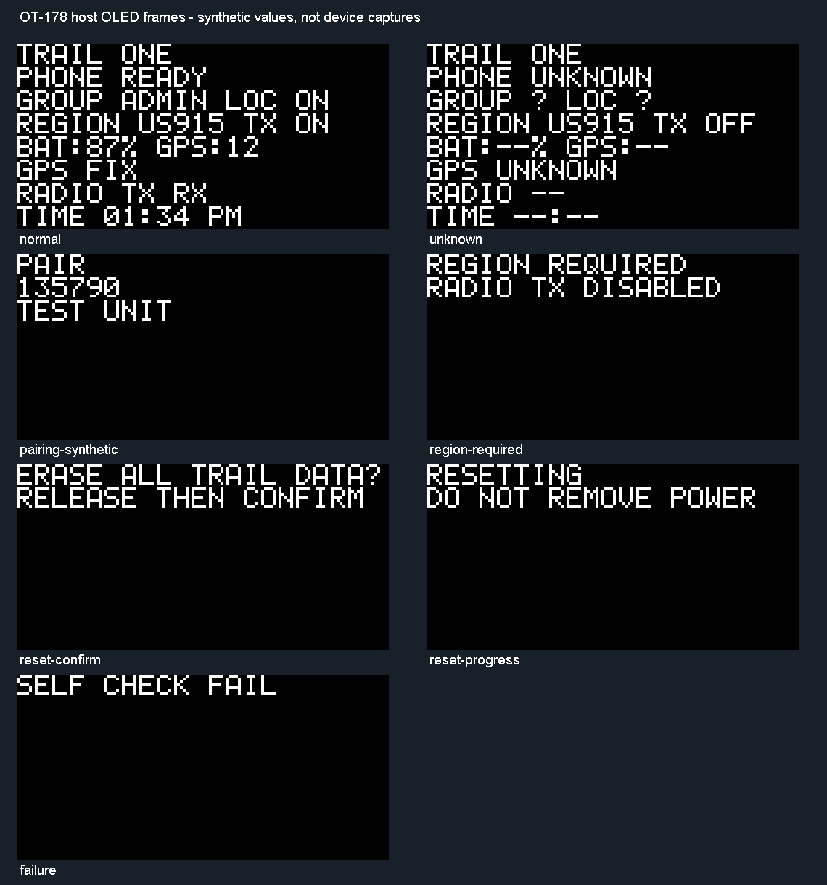

# OT-178 OLED/clock presentation foundation - 2026-09-06

Scope: hardware-neutral host presentation components only. No target CMake/source,
ESP-IDF configuration, image, Android app/protocol or installed firmware change.
This does not implement a phone time-sync transport or accept physical OLED use.

## Porting preflight

Read docs/firmware-porting-lessons.md before implementation. The future target is
the retained experimental Heltec V4/V4.2 with a 128x64 monochrome OLED. This task
keeps the existing target and current radio/partition/boot/BLE settings unchanged.
Hardware profile, live ports and installed readback are not re-probed because
there is no target build or hardware execution. Every target gate must be refreshed
before the later adapter/wiring increment.

| Checklist | Applicability/result |
| --- | --- |
| 1. Target boundary | Applied: fixed 128x64 frame contract, target-neutral components under ui/time; no target linkage or capability claim. Board pin/profile verification deferred to target wiring. |
| 2. Reproducibility | Host sources/tests are versioned and compiler flags recorded below. Two ESP-IDF builds/ELF/map/partition inspection skipped: no target source or build input changes. Required after target wiring. |
| 3. Boot/USB/reset | Not exercised: no transport, console, reset or boot change. |
| 4. Ordering/concurrency | Applied: pure fresh frame from one coherent caller snapshot; clock and snapshot serialized by future owner. Tests cover priority, expiry, stale/future input and rollback; no blocking GATT callback added. |
| 5. Persistence/cleanup | No persistence, owner or bond mutation. Pairing digits exist only in caller input/returned frame; subsequent frames are cleared. Physical panel concealment after write failure remains a target integration gate. |
| 6. Composed validation | Focused clock/frame tests and complete Host matrix required. Target adapter/ELF/build checks deferred because components are not linked to firmware. |
| 7. Hardware | Not authorized by this host-only increment; no serial, flash, reset, radio or power action. Cold-power remains owner-deferred. |

## Scope limits

The renderer does not grant Ready, TX, group, region or time-source authority.
The future adapter must supply an independently authorized coherent snapshot.
Missing or stale values render unavailable; the device name is replaceable display
metadata. No coordinates appear on the normal page. The deliberate coordinate
page, live settings/group/location/time synchronization, persistent configuration,
physical concealment/failure injection, current draw and two-device acceptance
remain open. Website updates remain owner-deferred.

## Implemented and focused validation

Decision0105 defines fixed five-column/seven-bit text rendering with bounded
metadata truncation. Eight rows produce an exact1024-byte SSD1306 page buffer;
unused rows, inter-glyph columns and final three columns remain clear. Exclusive
safety frames contain no normal telemetry or stale pairing digits. Presentation
rollback permanently contains the owner without retaining any input payload.

Clock tests pass6 groups: unknown/12h/24h boundaries, midnight progression,
24-hour expiration, invalid/old/future sync, rollback/recovery and UINT64 limits.
Frame tests pass6 groups: every safety-priority combination and pairing deadline,
rollback containment, unavailable authority, metric/activity boundary ages,
all256 input bytes/invalid enums/pixel bounds and composed clock validation.
The known D glyph is compared with fixed pixel columns, not just rendered text.
Tests cover all8 rows staying NUL-terminated and within the128x64 allocation.

Focused GCC compilation used C++17 -Wall -Wextra -Wpedantic -Werror -O2 with ui
and time include roots. Both test programs passed; optional PBM export generated
seven frames from synthetic values. The generated pixel preview was inspected:
all normal status fields fit, long labels reserve TX visibility, and exclusive
pairing/reset/failure/region surfaces clear unrelated rows. This is host pixel
review, not physical legibility acceptance. No real PIN/device data was used.

The two suites are registered in tools/Test-Host.ps1. Independent source review
confirmed clock arithmetic and buffer bounds; its rollback-resurrection concern
was corrected with the presentation owner and regression. The complete tools/Test-Host.ps1 matrix passed (exit0), including the two new
suites, governance10, Android admission23, publication safety, signature-vector
verification, Windows loader59 groups and simulator native UI13/13.
Compiler: MSYS2 UCRT64 GCC16.1.0 Rev5. Private full log retained locally. Android/target source is unchanged;
prior Android874 matrix and firmware evidence remain scoped to their artifacts.
Baseline ff4d070 GitHub Host run34016774891 completed successfully before this
increment's publication. All101 recorded owner file hashes remain unchanged.
V1 milestones and history are retained: exact43.75%, displayed44%, no increase.

A separate owner-requested phone screensaver preference was configured while
validation ran. It did not install an app or exercise Trail, BLE or firmware;
it provides no OLED or phone-workflow acceptance evidence.
